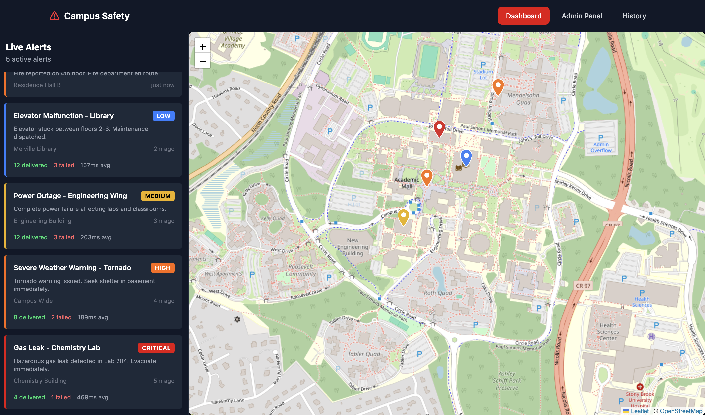
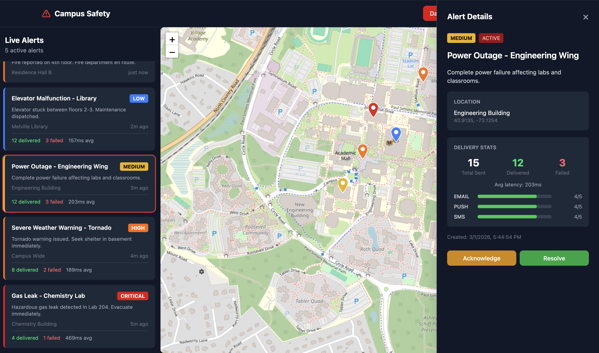
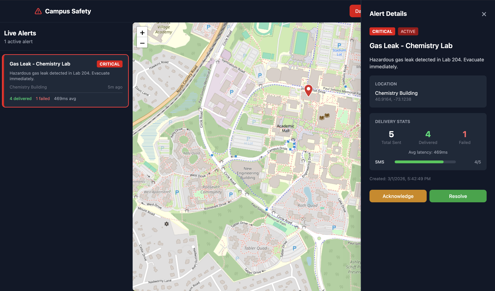
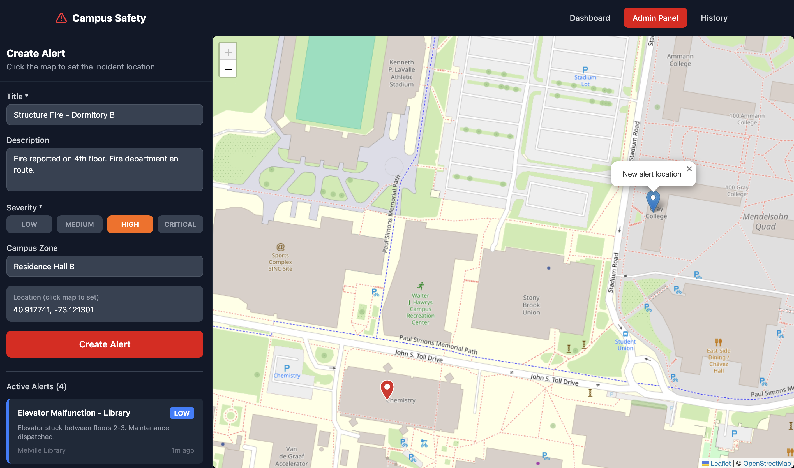
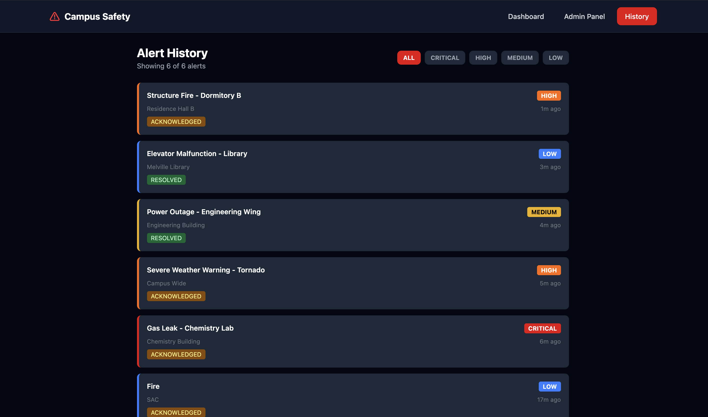
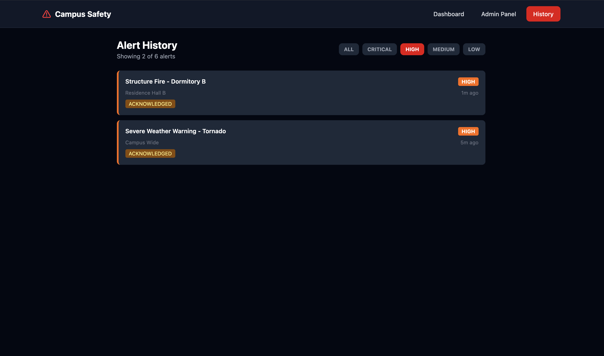

# Real-Time Campus Safety Alert System

A distributed, event-driven microservices platform for real-time campus safety alerting. The system ingests safety incidents, processes and enriches them, fans out notifications across multiple delivery channels in under 2 seconds, and provides students with a live situational awareness dashboard.

## Architecture

The system follows an event-driven microservices pattern with four Spring Boot services communicating asynchronously through Apache Kafka.

```
┌─────────────────┐     ┌──────────────────┐     ┌──────────────────┐
│  Alert Ingestion │────▶│ Alert Processing  │────▶│  Notification    │
│  Service         │     │ Service           │     │  Service         │
│  (Port 8081)     │     │ (Port 8082)       │     │  (Port 8083)     │
└─────────────────┘     └──────────────────┘     └──────────────────┘
        │                        │                        │
        ▼                        ▼                        ▼
   alert-created           alert-enriched        alert-delivery-status
   (Kafka Topic)           (Kafka Topic)           (Kafka Topic)
                                                         │
┌────────────────────────────────────────────────────────┘
▼
┌──────────────────┐     ┌──────────────────┐
│  Dashboard        │────▶│  React Frontend   │
│  Service          │     │  (Port 3000)      │
│  (Port 8080)      │     └──────────────────┘
└──────────────────┘
```

### Services

| Service | Port | Responsibility |
|---------|------|---------------|
| Alert Ingestion | 8081 | Accepts alert creation, validates, persists to PostgreSQL, publishes to Kafka |
| Alert Processing | 8082 | Enriches alerts with geo-radius affected buildings, determines recipient lists |
| Notification | 8083 | Fans out delivery across email, SMS, push channels; tracks delivery status |
| Dashboard | 8080 | GraphQL API gateway, WebSocket connections, real-time updates |

## Screenshots

### Live Dashboard
Real-time alert feed with campus map showing color-coded severity markers.



### Alert Details & Actions
Click any alert to view full details, delivery stats per channel, and Acknowledge/Resolve actions.



### Critical Alert View
Critical alerts highlighted with delivery statistics and response actions.



### Admin Panel
Create new alerts with severity selection, campus zone, and map-based location picker.



### Alert History
Browse all alerts with severity filter buttons and status tracking.



### Severity Filter
Filter alerts by severity level (CRITICAL, HIGH, MEDIUM, LOW).



### Grafana Monitoring Dashboard
Real-time observability with alert throughput, delivery success rates, WebSocket connections, and service health.


## Tech Stack

| Layer | Technologies |
|-------|-------------|
| Backend | Java 17, Spring Boot 3.2, Spring Kafka, Spring WebSocket, Spring Data JPA |
| API | Spring GraphQL, Apollo Client |
| Messaging | Apache Kafka (3-node cluster) |
| Frontend | React 18, TypeScript, Apollo Client, Leaflet.js, Tailwind CSS |
| Database | PostgreSQL 16, Redis 7 |
| Observability | Prometheus, Grafana, Micrometer, Spring Actuator |
| Infrastructure | Docker Compose, GitHub Actions CI/CD |

## Getting Started

### Prerequisites

- Java 17+
- Maven 3.9+
- Docker & Docker Compose
- Node.js 18+

### Run Infrastructure

```bash
docker compose up -d
```

This starts Kafka (3 brokers), Zookeeper, PostgreSQL, Redis, Prometheus, and Grafana.

### Build & Run Services

```bash
# Build all services
mvn clean package -DskipTests

# Run individual services
cd alert-ingestion-service && mvn spring-boot:run
cd alert-processing-service && mvn spring-boot:run
cd notification-service && mvn spring-boot:run
cd dashboard-service && mvn spring-boot:run
```

### Create a Test Alert

```bash
curl -X POST http://localhost:8081/api/alerts \
  -H "Content-Type: application/json" \
  -d '{
    "title": "Suspicious activity near SAC",
    "description": "Unidentified individual reported near Student Activities Center",
    "severity": "HIGH",
    "lat": 40.9136,
    "lng": -73.1235,
    "campusZone": "Student Activities Center"
  }'
```

### Start Frontend

```bash
cd frontend
npm install
npm run dev
```

Open http://localhost:3000

## Monitoring & Observability

- **Frontend Dashboard**: http://localhost:3000
- **GraphQL Playground**: http://localhost:8080/graphiql
- **Prometheus**: http://localhost:9091
- **Grafana**: http://localhost:3001 (admin/admin)

### Grafana Dashboard Panels
1. **Alert Throughput** - Alerts created per minute by severity
2. **Kafka Consumer Lag** - Per-service consumer group lag
3. **Delivery Latency** - P50/P95/P99 delivery latency by channel
4. **Delivery Success Rate** - Delivered vs failed by channel
5. **WebSocket Connections** - Active subscription count
6. **Service Health** - Up/down status for each microservice

### Custom Metrics

| Metric | Type | Service | Description |
|---|---|---|---|
| `alerts.created.count` | Counter | Ingestion | Total alerts created, tagged by severity |
| `alerts.enriched.count` | Counter | Processing | Alerts enriched, tagged by severity |
| `alerts.duplicate.count` | Counter | Processing | Duplicate alerts rejected |
| `alerts.delivery.latency` | Timer | Notification | Delivery duration by channel |
| `alerts.delivery.failure.count` | Counter | Notification | Failed deliveries by channel |
| `websocket.connections.active` | Gauge | Dashboard | Active WebSocket subscriptions |

## Testing

```bash
# Unit tests (29 tests)
mvn test -DexcludedGroups=integration

# Integration tests (requires Docker)
mvn test -Dgroups=integration

# All tests
mvn verify

# Frontend type check + build
cd frontend && npx tsc --noEmit && npm run build
```

## CI/CD

GitHub Actions pipeline runs on every push and pull request to `main`:
- **Backend**: Maven build + unit tests with PostgreSQL and Redis service containers
- **Frontend**: ESLint, TypeScript check, Vite production build
- **Docker**: Builds all 5 Docker images after tests pass

## Project Structure

```
campus-safety-alert-system/
├── .github/workflows/ci.yml         # GitHub Actions CI pipeline
├── docker-compose.yml
├── pom.xml                          # Parent POM (multi-module)
├── alert-ingestion-service/         # Alert creation & Kafka producer
├── alert-processing-service/        # Event enrichment & processing
├── notification-service/            # Multi-channel notification delivery
├── dashboard-service/               # GraphQL API & WebSocket gateway
├── frontend/                        # React + TypeScript dashboard
├── prometheus/                      # Prometheus scrape configuration
└── grafana/                         # Grafana provisioning & dashboards
```

## Author

**Priya More** - Stony Brook University
